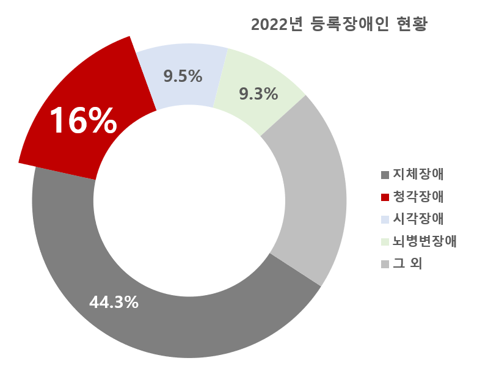
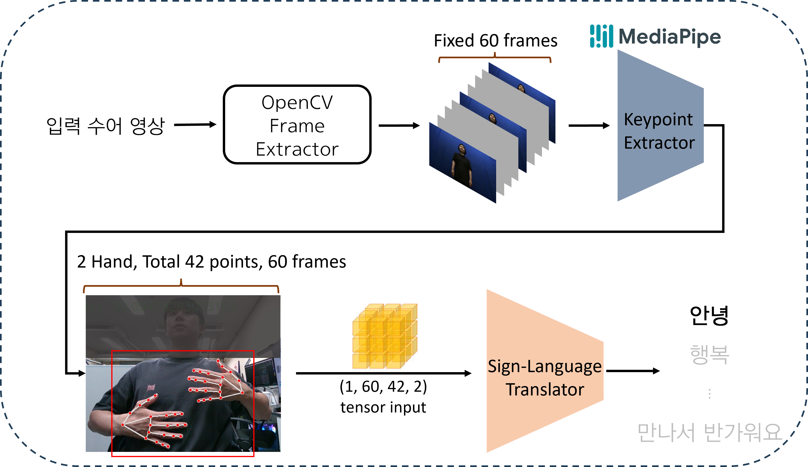
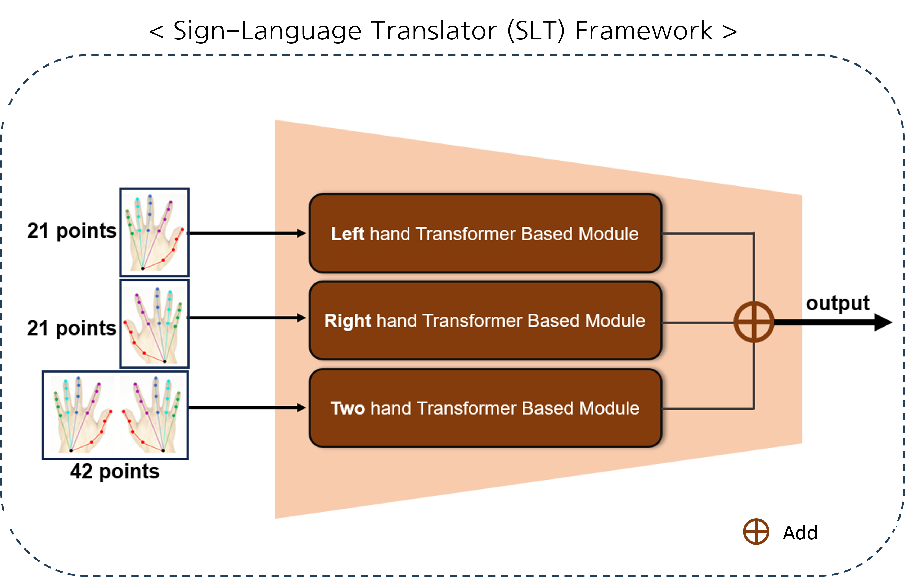
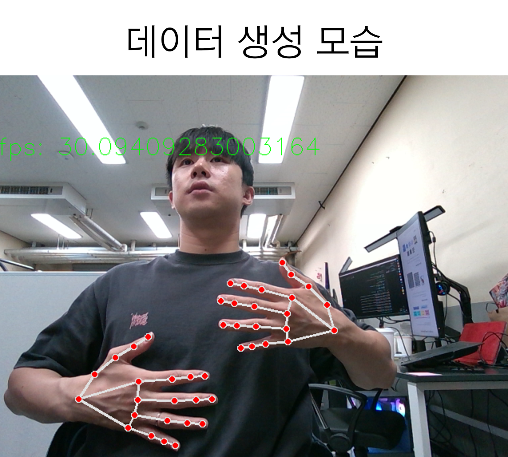
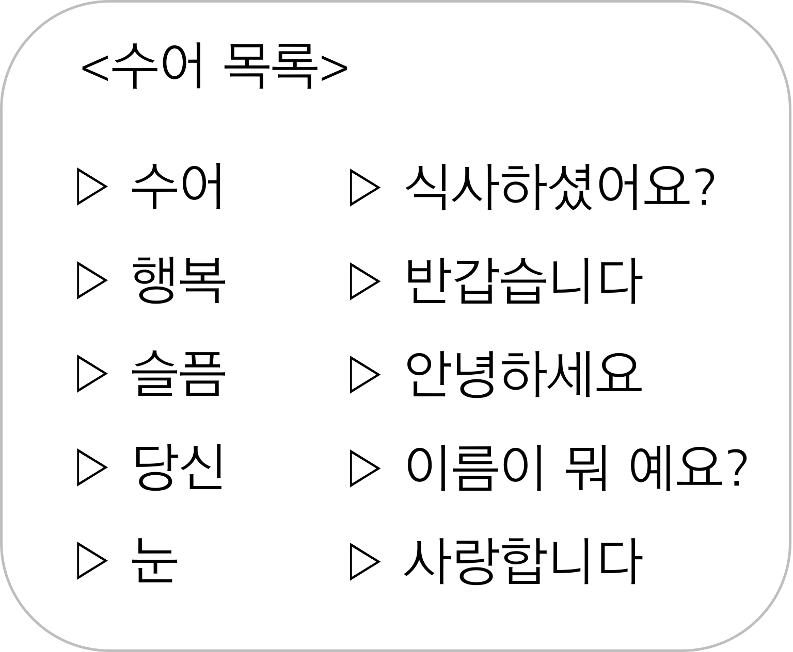
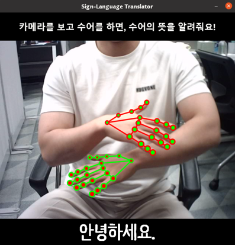

# Mono RGB Video 기반의 Hand Keypoint Detection 및 수어 통역 시스템


## 1. 프로젝트 소개

보건복지부에서 발표한 ‘2022년 등록장애인 현황’에 따르면, 국내에서 청각장애를 가진 사람들은 총 42.4만명으로 장애인구 중 지체장애에 이어 두번째로 많은 장애 유형이다.  
  
국립국어원에 따르면, 청각장애인 중, 수어를 1순위 의사소통 방법으로 사용한다고 응답한 비율이 55.9%로 조사되었으며 농인들의 주 언어는 한국어가 아닌 수어로, 공공시설의 한글 정보 체계를 받아들이지 못하는 경향이 크다.  
  
청각장애인은 사회 전반에 걸친 청인 중심의 정보 전달 체계로 인해 일상생활, 경제활동, 긴급상황 등 거의 모든 분야에 걸쳐 다양한 고충을 겪으며 최종적으로 사회 통합과 참여에 있어 제한을 겪고 있다. 우리는 이러한 농인들의 불편을 해소하기 위해 무엇을 할 수 있을지 고민했다.



## 2. 팀원 구성

2023 전기 부산대학교 정보컴퓨터공학부 졸업과제 07번 조 `VIP`  
VIP는 부산대학교 시각지능 및 인지연구실 (Vision Intelligence and Perception Lab, VIPLab)의 이름으로부터 착안했다.

- [[팀장] 박재형](https://github.com/ianpark318)  
  
  
  - 💌 [ianpark318@gmail.com](mailto:ianpark318@gmail.com)
    - 수어 통역 모델 학습
    - 학습 파이프라인 설계 및 구축
    - Hand pose estimation 라이브러리 적용 코드 구현
    - 직접 촬영 영상으로부터 데이터셋 구축
    - 데이터 전처리 코드 작성
    - 착수, 중간보고서, 시연계획서, 포스터 작성  
    <br>
  
- [전민수](https://github.com/minsuuuj)  
    
  
  - 💌 [wjsrl528@gmail.com](mailto:wjsrl528@gmail.com)
    - 관련 Dataset 및 Model 탐색
    - Real-time Hand Pose Estimation 알고리즘 개발
    - Open CV Visualization 부분 개발
    - Custom Dataset 데이터 생성
    - 최종 보고서 작성 및 포스터 제작

## 3. 시스템 Framework



1. s 키를 누르면 영상 촬영이 시작되고, e 키를 누르면 촬영이 완료되며, OpenCV로부터 실시간 동영상의 frame을 추출
2. 1번에서 frame이 추출됨과 동시에 Mediapipe를 통해 hand keypoints를 검출
3. 추출된 Frame의 수가 60개보다 적거나 많을 경우, 이를 60개의 고정된 frame 개수로 보간(interpolation)하여 입력 tensor의 shape을 (1, 60, 42, 2)으로 세팅
4. Tensor를 학습된 Sign-Language Translator로 전달하여 추론
5. Output으로 나온 tensor의 값 중, 가장 큰 값에 해당하는 index를 수어 목록에서 찾고 이를 화면에 시각화함으로써 수어 통역 서비스를 사용자에게 제공

#### Base Model

Sign-Language Translation Model은 총 3개의 Transformer Based Module로 구성되어 있다. 두 개는 왼손, 오른손 각 21개의 points를 입력으로 받으며, 나머지 하나는 양손을 합친 42개의 points를 입력으로 받는다. 이와 같은 구조를 가진 Sign-Language Translator를 사용함으로써 왼손, 오른손 각각의 역할이 다른 수어를 판별하는데 큰 효과를 얻을 수 있음을 확인하였다. 세 가지 모듈에서 나온 output은 scalar값으로, 세 값을 단순 덧셈해주어 output으로 산출한다.


### Dataset
본  프로젝트에 적합한 데이터셋이 존재하지 않아, 데이터셋을 직접 생성하였다.
- 일정 구간에서 Hand Keypoint를 추출하여 저장하는 알고리즘을 고안
- 일상적 수어 10개를 선정하고 해당 수어들에 대해 공부하여 숙지
- 각 수어를 팀원 당 25번 시연하여 총 500개의 2D Keypoint data를 획득
- 이렇게 획득한 Keypoint를 SLT 모델 학습의 Sudo Ground Truth로 활용



#### Dataset Hierarchy

```
📦our_data
 ┣ 📁01
 ┃ ┣ 📜kp_01_1.json
 ┃ ┣ 📜kp_01_2.json
 ┃ ┣        ⋮
 ┃ ┗ 📜kp_01_50.json
 ┣ 📁02
 ┣ 📁03
 ┣ 📁04
 ┣ 📁05
 ┣ 📁06
 ┣ 📁07
 ┣ 📁08
 ┣ 📁09
 ┗ 📁10
```

### 수어 말뭉치(Gloss)

본 프로젝트에서 분류할 말뭉치는
1. 상징성 (수어)
2. 일상성 (당신, 식사하셨어요?, 반갑습니다, 이름이 뭐예요?)  
을 띄는 단어로 선정하였다.

## 4. 소개 및 시연 영상

### 출력 결과



### [시연 영상](https://chatfoodie.net/)


## 5. 설치 및 사용법

### Inference

1. First, clone our repository.
```
$ git clone https://github.com/pnucse-capstone/capstone-2023-1-07.git
```
2. Then set up dependencies. 
```
$ cd capstone-2023-1-07
$ pip install -r requirements.txt
```

3. Run `hpe2d.py`
```
$ python hpe2d.py
```

If there is an error, fix `hpe2d.py` line 20 like below.
```
# You should check which camera you will use.
cap = cv2.VideoCapture(0)
```

If screen shows up, 
- press `S` button to start record
- press `E` button to finish recording

Then model will estimate and visualize what sign-language gloss you performed!

